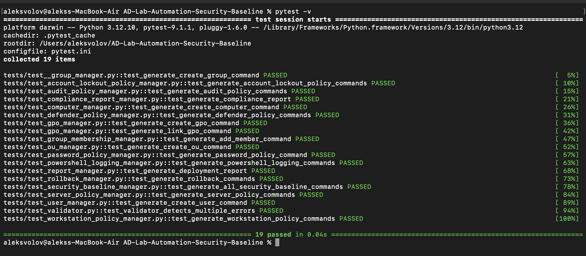

# AD-Lab-Automation-Security-Baseline

Enterprise-style Active Directory deployment and security baseline automation toolkit.

This project automates the generation of PowerShell commands for Active Directory deployment, security hardening, policy enforcement, validation, reporting, and rollback operations using a configuration-driven architecture.

The toolkit is designed as a portfolio project for Security Engineering, Active Directory Administration, and Cybersecurity Automation.


### Project Highlights

- Configuration-driven architecture
- Modular manager design
- Enterprise-style Active Directory deployment
- Security baseline automation
- Microsoft Defender hardening
- Account lockout enforcement
- Audit policy generation
- Configuration validation
- Automated reporting
- Rollback support
- Full pytest coverage
- PowerShell command generation
- Automated security compliance scoring

---

## Technologies Used

### Programming Languages
- Python 3
- PowerShell

### Active Directory
- Organizational Units (OU)
- User Management
- Group Management
- Group Policy Objects (GPO)

### Security
- Microsoft Defender Hardening
- Password Policies
- Account Lockout Policies
- Audit Policies
- PowerShell Logging

### Development & Testing
- Git
- GitHub
- Pytest
- Configuration-Driven Architecture

### Documentation
- Markdown
- Changelog
- Release Notes
- Technical Documentation

---

## Features

- Organizational Unit (OU) deployment
- Active Directory group creation
- Active Directory user creation
- Active Directory computer creation
- Group membership automation
- Group Policy Object (GPO) deployment
- Password policy generation
- Workstation security baseline generation
- Server security baseline generation
- Microsoft Defender baseline generation
- Account lockout policy generation
- Audit policy generation
- Configuration validation engine
- Deployment report generation
- Rollback command generation
- Configuration-driven deployment
- PowerShell script generation
- Security logging and reporting
- Automated testing with pytest
- Security compliance report generation
- Automated security compliance scoring

---

## Architecture

```text
config.json
      |
      v
Config Validator
      |
      v
deploy.py
      |
      +--------------------+
      |                    |
      v                    v
AD Managers          Security Managers
      |                    |
      +---------+----------+
                |
                v
PowerShell Script Generation
                |
                v
Reports + Logs + Rollback Scripts
```

---

## Manager Components

| Component | Responsibility |
|------------|----------------|
| OUManager | Generate OU creation commands |
| GroupManager | Generate AD group creation commands |
| UserManager | Generate AD user creation commands |
| ComputerManager | Generate AD computer creation commands |
| GroupMembershipManager | Generate group membership commands |
| GPOManager | Generate GPO deployment commands |
| PasswordPolicyManager | Generate password policy commands |
| WorkstationPolicyManager | Generate workstation hardening commands |
| ServerPolicyManager | Generate server hardening commands |
| DefenderPolicyManager | Generate Microsoft Defender policy commands |
| AccountLockoutPolicyManager | Generate account lockout policy commands |
| AuditPolicyManager | Generate audit policy commands |
| ConfigValidator | Validate deployment configuration |
| ReportManager | Generate deployment reports |
| RollbackManager | Generate rollback commands |
| ComplianceReportManager | Generate security compliance reports |

---

## Usage

Generate deployment scripts:

```bash
python3 deploy.py
```

Generate rollback scripts:

```bash
python3 cleanup.py
```

Run all tests:

```bash
pytest -v
```

Compile project for syntax validation:

```bash
python3 -m py_compile deploy.py
```

---

## Generated Files

Generated PowerShell files are saved to:

```text
docs/generated/
```

Deployment reports are saved to:

```text
reports/
```

Logs are saved to:

```text
logs/
```

Rollback scripts are saved to:

```text
rollback/reports/
```

---

## Security Baseline

### Password Policy

- Minimum password length: 12 characters
- Password complexity enabled
- Password history: 24 passwords
- Maximum password age: 90 days
- Minimum password age: 1 day

### Account Lockout Policy

- Lockout threshold: 5 failed attempts
- Lockout duration: 15 minutes
- Observation window: 15 minutes

### Microsoft Defender Policy

- Real-time protection enabled
- Cloud-delivered protection enabled
- Automatic sample submission enabled
- Behavior monitoring enabled
- Script scanning enabled

### Workstation Security

- Auto-lock screen after 5 minutes
- Disable Control Panel access
- Disable CMD for standard users
- Restrict PowerShell access

### Server Security

- Require SMB signing
- Restrict anonymous enumeration
- Limit blank password usage
- Enable secure channel protections

### Audit Policy

- Logon auditing
- Credential validation auditing
- User account management auditing
- Security group management auditing
- Directory service change auditing
- File system auditing
- Process creation auditing

---

## Validation Engine

The ConfigValidator verifies deployment configurations before script generation.

Validation checks include:

- Duplicate usernames
- Duplicate group names
- Duplicate computer names
- Weak passwords
- Forbidden usernames
- Invalid OU references
- Invalid membership references
- Configuration consistency

This prevents generation of invalid Active Directory deployment scripts.

---

## Reporting

The ReportManager generates deployment reports containing:

- Domain information
- Domain DN
- OU count
- Group count
- User count
- Computer count
- Membership count
- GPO count
- Validation status
- Generated file inventory

Reports are saved automatically during deployment.

---

## Rollback Support

The project generates rollback PowerShell scripts that can remove:

- Organizational Units
- Users
- Groups
- Computers
- GPOs

Rollback scripts are generated separately from deployment scripts to reduce operational risk.

---

### Compliance Report

The toolkit automatically evaluates generated security controls and produces a compliance report.

Example:

Password Policy ............. PASS
Workstation Security ........ PASS
Server Security ............. PASS
Defender Policy ............. PASS
Account Lockout Policy ...... PASS
Audit Policy ................ PASS
PowerShell Logging .......... PASS

Compliance Score: 100%

---

## Project Structure

```text
AD-Lab-Automation-Security-Baseline/

├── ad/
│   ├── ou_manager.py
│   ├── group_manager.py
│   ├── user_manager.py
│   ├── computer_manager.py
│   └── group_membership_manager.py
│
├── gpo/
│   ├── gpo_manager.py
│   ├── password_policy_manager.py
│   ├── workstation_policy_manager.py
│   ├── server_policy_manager.py
│   ├── defender_policy_manager.py
│   ├── account_lockout_policy_manager.py
│   └── audit_policy_manager.py
│
├── rollback/
│   └── rollback_manager.py
│
├── utils/
│   ├── config_loader.py
│   ├── logger.py
│   ├── validator.py
│   └── report_manager.py
│
├── tests/
│   ├── test_ou_manager.py
│   ├── test_group_manager.py
│   ├── test_user_manager.py
│   ├── test_computer_manager.py
│   ├── test_group_membership_manager.py
│   ├── test_gpo_manager.py
│   ├── test_password_policy_manager.py
│   ├── test_workstation_policy_manager.py
│   ├── test_server_policy_manager.py
│   ├── test_defender_policy_manager.py
│   ├── test_account_lockout_policy_manager.py
│   ├── test_powershell_logging_manager.py
|   ├── test_audit_policy_manager.py
│   ├── test_report_manager.py
│   ├── test_validator.py
│   └── test_rollback_manager.py
│
├── docs/
├── reports/
|   ├── deployment_report.txt
|   |── security_compliance_report.txt
├── logs/
├── deploy.py
├── cleanup.py
├── config.json
└── README.md
```

---

## Testing

Covered Components:

* OUManager
* GroupManager
* UserManager
* ComputerManager
* GroupMembershipManager
* GPOManager
* PasswordPolicyManager
* WorkstationPolicyManager
* ServerPolicyManager
* DefenderPolicyManager
* AccountLockoutPolicyManager
* AuditPolicyManager
* PowerShellLoggingManager
* SecurityBaselineManager
* RollbackManager
* ReportManager
* ComplianceReportManager
* ConfigValidator

Run All Tests

```text
19 tests passed
```

---

## Test Results

All automated tests passed successfully.



---

## Future Improvements

- Real GPO backup deployment
- CIS Benchmark alignment
- Splunk integration
- Windows Event Forwarding support
- Security dashboard generation
- Threat hunting configuration generation
- Azure AD / Entra ID integration
- Hybrid AD deployment support

---

## Status


Completed:

- Active Directory Deployment
- Group Management
- Computer Management
- Membership Automation
- GPO Deployment
- Password Policy
- Workstation Security Baseline
- Server Security Baseline
- Microsoft Defender Baseline
- Account Lockout Policy
- Audit Policy
- Configuration Validation
- Deployment Reporting
- Rollback Generation
- Automated Testing

Current Test Status:

```text
19 PASSED
```

Project Status:

```text
Production Ready (Generation Layer)
```

Next Development Phase:

```text
 – Advanced Security & Integration
```
